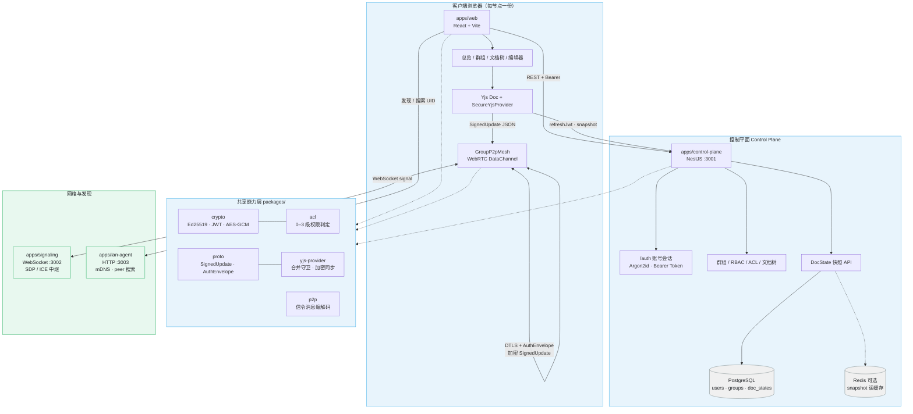
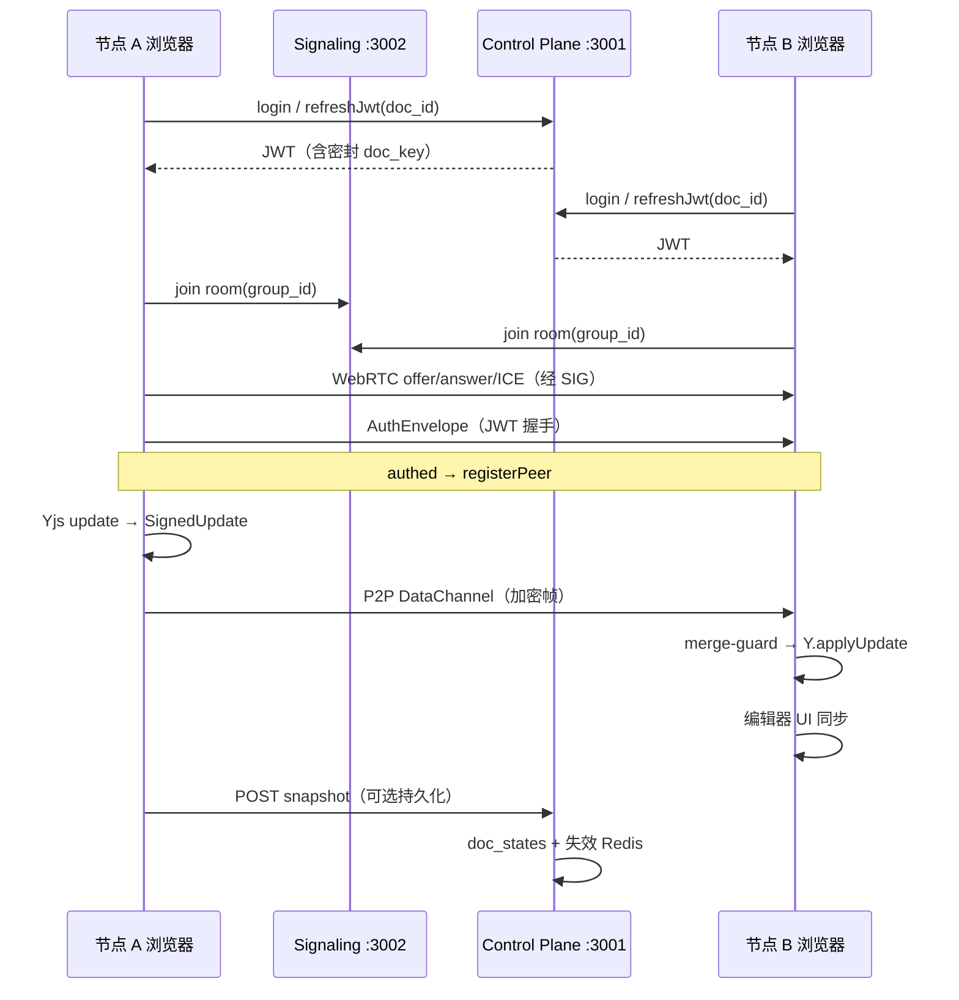

# DPE Architecture

See [design.md](./design.md) for the cryptographic and P2P design.

## 整体架构图

系统采用 **控制平面** 与 **数据平面** 分离：元数据、认证与权限由本机控制平面统一管理；文档协作更新经 **WebRTC P2P** 直连同步，载荷为 **AES-GCM 加密的 SignedUpdate**，合并前由 `yjs-provider` 做 ACL 校验。

### 协作数据流（单文档）

## Components

- **apps/web** — React UI（登录/注册、总览、群组工作区、文档树、内联编辑器）
- **apps/control-plane** — NestJS IdP（账号认证、JWT、逐文档 ACL、RBAC、文档树、快照）
- **apps/signaling** — WebRTC 信令（WebSocket mesh 房间）
- **apps/lan-agent** — mDNS / LAN 发现（Windows + Linux）
- **packages/** — `crypto`, `proto`, `acl`, `p2p`, `yjs-provider`, `shared`

## Control modes

- `owner_direct` — owner signs JWT
- `proxy` — proxy server allocates permissions (default for demos)

## 端口一览（开发环境）

| 服务 | 端口 | 说明 |
|------|------|------|
| Web (Vite) | 5173 | 前端 SPA |
| Control plane | 3001 | REST API、认证、快照 |
| Signaling | 3002 | WebRTC 信令 |
| LAN agent | 3003 | 局域网发现 |
| PostgreSQL | 5432 | 持久化（Docker Compose） |
