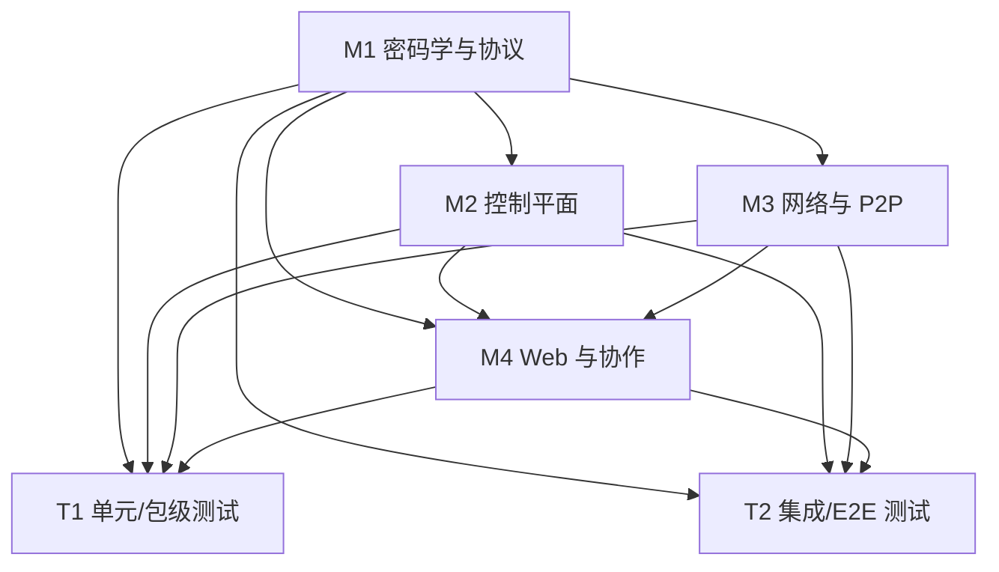

# DPE 模块分工总览

本项目按**相对独立**原则划分为 **4 个开发模块** 与 **2 个测试模块**。各模块有明确的工作目录边界、职责与验收目标；详细说明见同目录下对应 Markdown。

## 模块一览

| 编号 | 类型 | 文档 | 一句话 |
|------|------|------|--------|
| M1 | 开发 | [dev-01-crypto-protocol.md](./dev-01-crypto-protocol.md) | 密码学、协议 schema、ACL 策略、共享类型 |
| M2 | 开发 | [dev-02-control-plane.md](./dev-02-control-plane.md) | 群组、RBAC、JWT、文档树、Operable RPC |
| M3 | 开发 | [dev-03-network-p2p.md](./dev-03-network-p2p.md) | 信令、LAN 发现、P2P 握手与传输 |
| M4 | 开发 | [dev-04-web-collaboration.md](./dev-04-web-collaboration.md) | Web UI、Yjs 安全同步、端到端协作体验 |
| T1 | 测试 | [test-01-unit-package.md](./test-01-unit-package.md) | 包级/服务级单元测试与 P1–P5 离线验收 |
| T2 | 测试 | [test-02-integration-e2e.md](./test-02-integration-e2e.md) | 全链路 E2E、安全审计、双机与 CI 验收 |

## 依赖关系（开发）

## 阶段文档对照

| 阶段 | 主要归属模块 |
|------|----------------|
| P1 | M1 |
| P2 | M2 |
| P3 | M3 |
| P4 | M4（`@dpe/yjs-provider`） |
| P5 | M4（`apps/web`） |
| P6 | T2（全仓 + 双机清单） |

## 协作约定

- **接口契约**：跨模块变更须先更新 `@dpe/proto`（M1）或 OpenAPI/文档（M2），再改消费方。
- **环境**：根目录 `.env` / `.env.example`；VM 参考 `.env.vm.example`（与主示例一致使用 `localhost`）。
- **禁止越界**：各模块仅在本模块「工作区域」内改代码；跨模块需求通过 issue/评审约定接口，避免在错误目录实现业务逻辑。
